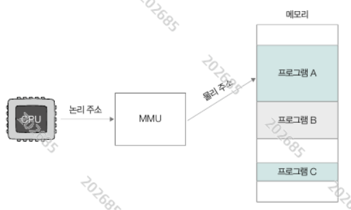
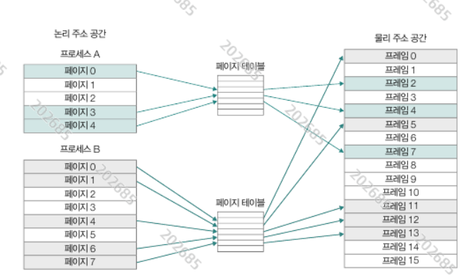
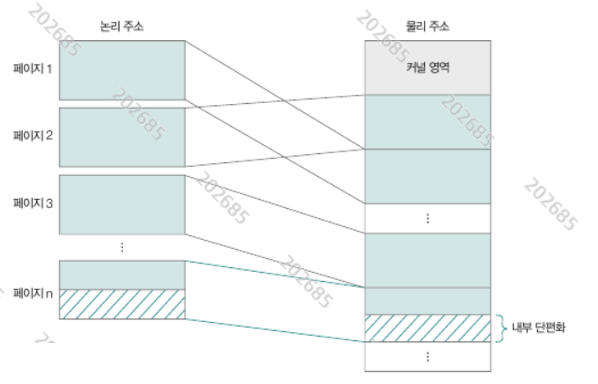

# 가상 메모리

## 물리 주소 & 논리 주소
물리 주소: 살제 메모리 공간 주소 <br/>
논리 주소: MMU(메모리 관리 유닛)이 무물리 주소로 해석해 줄 수 있는 주소 <br/>



CPU는 모든 메모리 공간 주소를 기록할 공간이 없기 때문에, <br/>
메모리 시작 주소만 논리 주소로 저장한다.

## 스와핑

실행하는 프로세스를 **메모리 영역**에 올리고, <br/>
실행하지 않는 프로세스 (ex 입출력 대기 중, 오랫동안 사용 x)를 <br/>
**스와핑 영역**(보조 기억 장치 일부)으로 내쫓는 작업

## 단편화 (연속 메모리 할당)
메모리 공간이 필요한 용량만큼 남아 있더라도 연속된 공간으로 남아 있는 것이 아니면(단편화)
프로세스를 메모리에 올릴 수 없다.(연속 메모리 할당 방식)
이는 효율적인 메모리 사용은 아니기 때문에 **연속 베모리 할당 방식은 보편적이지 않다**.

**가상 메모리 란?:** <br/>
물리 주소 공간과 다른 형태로 이루어진 논리 주소 공간의 메모리.

(예시) <br/>
보조 기억 장치의 일부를 메모리 영역처럼 사용하는 것. <br/>
실제 메모리 영역보다 더큰 메모리를 할당할 수 있게 된다. <br/>

## 페이징

프로세스의 <br/>

논리 주소 공간을 **페이지**로 나누고, <br/>
물리 주소 공간을 **프레임**으로 나눠서, <br/>

페이지를 프레임에 할당하는 가상 메모리 기법. <br/>
메모리 공간을 연속적으로 할당할 필요가 없어져서, 외부 단편화가 발생하지 않는다. <br/>

**외부 단편화**: <br/>
논리 주소 공간에서 봤을 때 존재하는 단편화. <br/>
(물리 주소 공간 단편화는 상관 x)

```
물리 주소 공간 단편화를 해결해주는 것 = 논리 주소 공간
논리 주소 공간 단편화를 해결해주는 것 = 페이징
페이징으로 인해 생기는 단편화 = 내부 단편화
```

```
(참고)  
세그멘테이션:  
일정한 단위로 나누는 페이지네이션과 달리, 가변적인 크기로 나누는 것을 세그멘테이션이라고 한다.
(페이지네이션 vs 세그멘테이션)
```

**페이징 단위의 스와핑** <br/>
프로세스의 일부 페이지만 메모리 영역에 올려서 실제 메모리보다 큰 프로세스도 실행이 가능해진다. <br/>
스왑 인/아웃 -> 페이징 인/아웃 에 해당. <br/>

**페이지테이블** <br/>
페이지의 물리 주소 공간에서 위치를 측정 할 수 있도록 주소를 저장하고 있는 정보 구조. ( 내부 단편화되어 있어도 가능하다 )



```
페이지 테이블 정보
1) 페이지 번호
2) 프레임 번호

3) 유효비트: 페이지(프레임)가 적재된 공간이 메모리(1)인지, 보조기억장치(0)인지 표시.
4) 보호비트: 페이지(프레임)에 대한 읽기(r), 쓰기(w), 실행(x) 권한 여부를 표시.
5) 참조비트: CPU가 해당 페이지에 접근한 적이 있는 지 여부(1|0)
6) 수정비트(더티비트): CPU가 데이터를 쓴 적이 있는 페이지인지 여부(1|0)
```
유효비트가 0인(메모리에 적재 안된) 페이지에 접근하려고 하는 것을 **페이지 폴트**라고 한다.

**내부 단편화:** <br/>
페이지 크기보다 메모리 사용량이 작아서 생기는 단편화 (못 쓰고 남는 메모리 공간)



**PTBR( 페이지 테이블 베이스 레지스터 )** <br/>
: 페이지 테이블이 적재된 메모리 위치를 저장. <br/>
-> 페이지 테이블은 사용될 페이지를 예측해서 미리 메모리에 적재 된다! <br/>
RTBR은 PCB 안에 기록되어 있다.

**TLB**<br/>
:페이지에 접근하기 윈한 캐시 메모리 
페이지 테이블에 접근하기 위해 한번,
페이지에 접근하기 위해 또 한번,
메모리에 최소 2번 접근하는데, 이 과정을 더 빠르게 하기 위해서 사용하는 페이지 테이블의 캐시 영역.
(캐시 메모리는 일반 메모리 ram보다 빠르므로)

TLB 히트/미스: 미리 사용될 것 같은 페이지 테이블을 잘 적개하면 히트, 아니면 미스.

## 페이지 교체 알고리즘

다음 프로세스를 위해 적재된 페이지를 스왑 아웃 하는 교체 알고리즘.

- FIFO 페이지 교체: 먼저 적재된 페이지부터 스왑 아웃 하는 방식.
- 최적 페이지 교체: 앞으로 사용 빈도가 낮을 페이지를 예측하여 스왑 아웃하는 방식. (예측을 구현하기 어렵다.)
- LRU 페이지 교체: '가장 적게 사용한' 페이지 부터 교체하는 방식. 보편적인 방식이다.

```
페이지 폴트 종류
- 메이저 폴트:
    물리 메모리에 페이지가 적재 안된 경우.
    -> 보조 기억 장치 입출력이 필요한 페이지 폴트 
- 마이너 폴트: 
    물리 메모리에 페이지가 적재되어 있지만, 페이지 테이블에 정보가 반영 안된 경우
    -> 보조 기억 장치 입출력이 필요 x
```

```
번외)
GPT에게 물어본 결과,
웹 개발자가 가상메모리와 페이징 기법에 대해 알아야 하는 경우는 없다고 합니다;;
```